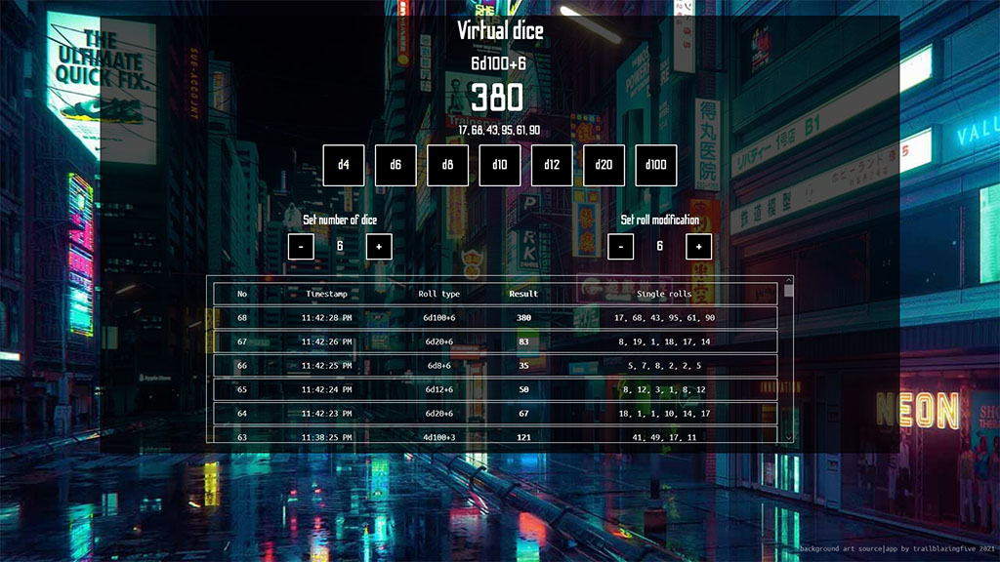

# Virtual Dice

React app with a set of D&D dice for tabletop sessions.

  

### Setup and deploy

+ `npm install` install packages
+ `npm start` start dev server
+ `npm deploy` build and deploy to github pages

---
### Features
+ default dice set `d4, d6, d8, d10, d12, d20, d100`
+ dice number and sum result `+/-` modifier
+ roll history with timestamp
+ responsive design

---
Merge to `production`, work on issues on seperate branches; avoid 3 way merges. 